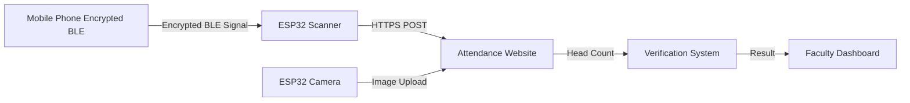

# Smart Attendance System using ESP32 & Encrypted BLE

## 📌 Overview
This project implements a **Smart Attendance System** using the **ESP32** microcontroller with **Encrypted Bluetooth Low Energy (BLE)** advertising detection and an integrated camera-based verification system.  
It automates attendance marking in classrooms by securely detecting nearby student mobile devices and verifying presence via image processing.

---

## 🚀 Features
- **Encrypted BLE Scanning**: Detects and verifies BLE advertisements from registered student mobile phones within a specified radius, ensuring spoof-proof attendance.
- **Secure Automated Attendance Marking**: Sends encrypted attendance data to a custom website.
- **Camera Verification**: Captures classroom images to count heads and match them against marked attendance.
- **Web Dashboard for Faculty**: Provides full access to attendance records, photos, and verification logs.
- **Tamper Prevention**: Encrypted communication prevents unauthorized device emulation.

---

## 🛠️ Hardware Requirements
- **ESP32 Development Board** (with BLE support)
- **Camera Module** (ESP32-CAM or external camera connected to ESP32)
- **Power Supply**
- **Mobile Devices** (with BLE enabled & paired with encryption keys)
- **Wi-Fi Connection**

---

## 💻 Software Requirements
- **Arduino IDE** / **PlatformIO**
- **ESP32 Board Support Package**
- **Encrypted BLE Library for ESP32**
- **HTTP Client Library**
- **Image Processing Backend** (for head count)
- **Custom Website** (for attendance storage & dashboard)

---

## 🔧 How It Works
1. **Encrypted BLE Detection**:  
   - ESP32 scans for encrypted BLE advertisements from registered student devices.
   - Verifies MAC addresses and decryption keys to ensure authenticity.
   
2. **Secure Attendance Logging**:  
   - Sends encrypted attendance data via HTTPS to the custom website.
   
3. **Camera Verification**:  
   - Captures a classroom image.
   - Sends image to the backend for **head count**.
   - Cross-verifies head count with marked attendance.
   
4. **Faculty Access**:  
   - Faculty can log in to the web portal to view:
     - Attendance records
     - Captured classroom images
     - Discrepancy reports

---

---

## 📡 API Endpoints
| Endpoint              | Method | Description                   |
|-----------------------|--------|--------------------------------|
| `/mark_attendance`    | POST   | Marks attendance via ESP32    |
| `/upload_image`       | POST   | Uploads classroom image        |
| `/get_attendance`     | GET    | Retrieves attendance records   |

---

## 🖼️ Workflow Diagram

## 📜 Installation & Setup

1. **Flash ESP32**:
    - Install Arduino IDE
    - Install ESP32 board manager
    - Upload `esp32_code` to ESP32

2. **Setup Web Backend**:
    - Install required dependencies (`requirements.txt`)
    - Run backend server
    - Configure API keys, database, and BLE encryption keys

3. **Connect ESP32 to Wi-Fi**:
    - Edit WiFi SSID and Password in code.

4. **Register Student Devices**:
    - Store  encrypted keys in the backend.

---

## 🔒 Security Implementation
- **AES-128 Encryption**: Each BLE packet is encrypted before advertising.
- **Device Whitelisting**: Only registered MAC addresses are processed.
- **Replay Attack Protection**: Packets include timestamps/nonces to prevent reuse.

---

## 📊 Future Improvements
- AI-based face recognition for identity verification.
- Offline storage & sync when internet is unavailable.
- Integration with university ERP systems.

---

## 📄 License
This project is licensed under the **MIT License** - see the [LICENSE](LICENSE) file for details.
EOF

